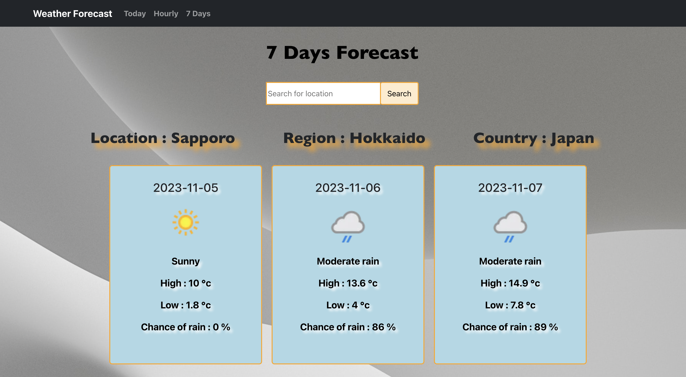
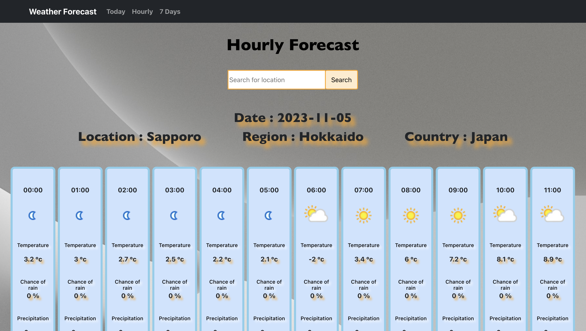

 

# Weather-app
 
 

## Today's weather

 
 

## Weekly forecast

 
 

## Hourly forecast

 
 

# DESCRIPTION
## ABOUT THE PROJECT
Weather forecast app
In this app, you can check the today's weather, weekly forecast, and hourly weather updates. The background changes based on the weather conditions of the day.
 
 
 

# TECHNOLOGIES
 
・ HTML 
・ CSS 
・ JavaScript 
・ React.js 
 
 

# REFERENCES
React-Bootstrap 
https://www.pinterest.ca/](https://react-bootstrap.github.io/ 

Weather API 
https://www.weatherapi.com/

Unsplash 
https://unsplash.com/ 
